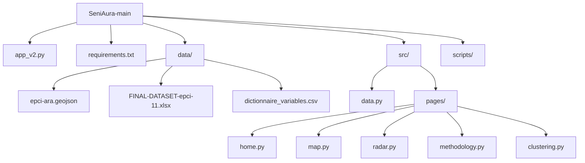

# Documentation Technique - SeniAura

Ce document fournit une vue d'ensemble détaillée, "ultra complète", du projet **SeniAura**, un tableau de bord interactif pour le diagnostic territorial de santé en région Auvergne-Rhône-Alpes.

---

## 1. Contexte et Objectifs

### 🎯 Objectif Principal
L'outil vise à établir un diagnostic des **Maladies Cardio-Neuro-Vasculaires (MCNV)** à l'échelle des **EPCI** (Établissements Publics de Coopération Intercommunale). Il croise des données de santé avec des déterminants socio-économiques et environnementaux pour aider les décideurs publics à cibler les actions de prévention.

### 👥 Public Cible
- **Élus et décideurs EPCI** : Diagnostic rapide de leur territoire.
- **ARS & CPTS** : Planification des ressources de santé.
- **Coordinateurs territoriaux** : Justification des demandes de subventions.

---

## 2. Architecture Technique

Le projet est une application web construite en **Python** avec le framework **Dash** (Plotly).

### Stack Technologique
- **Core** : Python 3.9+
- **Frontend/Backend** : Dash (Flask sous le capot)
- **UI Components** : Dash Mantine Components (DMC) et Dash Iconify (remplace HTML brut ou Bootstrap pour un design moderne)
- **Visualisation** : Plotly.py (Graph Objects & Express)
- **Data Manipulation** : Pandas, NumPy
- **Géomatique** : GeoPandas (fichiers GeoJSON)
- **Statistiques/ML** : Scikit-learn (pour le Clustering et la normalisation), SciPy.

### Structure du Projet



#### Fichiers Clés
- **`app_v2.py`** : Point d'entrée. Initialise l'application Dash, définit la mise en page globale (sidebar, navigation) et gère le routage entre les pages.
- **`src/data.py`** : Module central de gestion des données. Charge le GeoJSON et le dataset Excel, effectue les fusions et nettoie les types de données.
- **`src/pages/`** : Chaque fichier correspond à une vue du tableau de bord.
- **`scripts/rename_variables.py`** : Script utilitaire pour générer des noms courts ("Nom_Court") lisibles à partir des codes techniques des variables.

---

## 3. Comprendre Plotly Dash (Sous le capot)

Pour bien maintenir ce projet, il est crucial de comprendre comment **Dash** fonctionne. Dash n'est pas qu'une simple librairie graphique, c'est un framework complet qui fait le pont entre Python et le web moderne.

### A. Le Trio Technologique
Dash est une surcouche qui assemble trois technologies majeures :
1.  **Flask (Python)** : Le serveur web qui gère les requêtes HTTP.
2.  **React.js (JavaScript)** : La librairie qui gère l'interface utilisateur (Frontend) et le rendu des composants.
3.  **Plotly.js (JavaScript)** : Le moteur de rendu des graphiques interactifs.

> **💡 Note** : En tant que développeur Python, vous n'écrivez pas de JavaScript. Dash transpile vos classes Python (`html.Div`, `dcc.Graph`) en composants React virtuels.

### B. Les Layouts et Dash Mantine Components (DMC)
L'interface est définie comme un **arbre hiérarchique de composants Python**. Historiquement, Dash utilise `dash.html` et `dash.dcc`. Dans ce projet, nous utilisons massivement **Dash Mantine Components (`dmc`)** :

- **`dmc` (Dash Mantine Components)** : Fournit des composants UI modernes, esthétiques et réactifs (ex: `dmc.Container`, `dmc.Grid`, `dmc.Select`, `dmc.Alert`). C'est le pilier visuel du projet.
- **`dash.dcc` (Dash Core Components)** : Utilisé pour les graphiques (`dcc.Graph`) ou la gestion d'état (`dcc.Store`, `dcc.Location`).
- **`dash.html`** : Utilisé de manière résiduelle pour des balises standard (`html.Div`).

Chaque composant a des propriétés (arguments) :
- `id` : Identifiant unique (INDISPENSABLE pour les callbacks).
- `children` : Le contenu (texte ou liste d'autres composants).
- `style` / `className` : Pour l'ajustement visuel.

**Exemple de structure avec DMC :**
```python
layout = dmc.Container([
    dmc.Title("Mon Titre", order=1),
    dmc.Select(id='mon-dropdown', data=[...]),
    dcc.Graph(id='mon-graphique')
])
```

### C. La Réactivité : Les Callbacks
C'est le cœur du système. Un callback est une fonction Python décorée qui connecte des composants entre eux.

#### Le cycle de vie d'un Callback :
1.  **L'Événement (Frontend)** : L'utilisateur change une valeur dans un Input (ex: sélectionne un EPCI).
2.  **La Requête (HTTP)** : Le navigateur envoie une requête `POST` asynchrone au serveur Flask avec la nouvelle valeur.
3.  **L'Exécution (Backend)** : Python exécute la fonction décorée avec `@app.callback`.
4.  **La Réponse (JSON)** : La fonction retourne le résultat (ex: une nouvelle figure Plotly).
5.  **La Mise à jour (React)** : Le frontend reçoit le JSON et met à jour uniquement la partie modifiée du DOM (le `Output`).

#### Anatomie d'un Callback
```python
@callback(
    Output('target-id', 'property'),  # Ce qu'on modifie (ex: la figure du graph)
    [Input('source-id', 'value')],    # Ce qui déclenche (ex: la valeur du dropdown)
    [State('state-id', 'value')]      # (Optionnel) Ce qu'on lit sans déclencher
)
def update_function(input_val, state_val):
    # Logique métier en Python
    new_figure = ... 
    return new_figure
```

- **Input** : Déclencheur. Si sa valeur change, la fonction est appelée.
- **State** : Variable passive. On lit sa valeur au moment où un Input déclenche le callback, mais il ne déclenche rien lui-même.
- **Output** : La cible. La valeur retournée par la fonction sera assignée à cette propriété.

---

## 4. Données et Flux

### Sources de Données
1.  **Données Géographiques (`epci-ara.geojson`)** :
    - Limites administratives des EPCI de la région Auvergne-Rhône-Alpes.
    - **Clé de jointure** : `EPCI_CODE`.
    
2.  **Données Tabulaires (`FINAL-DATASET-epci-11.xlsx`)** :
    - Dataset principal contenant une ligne par EPCI.
    - Colonnes : Code EPCI, Nom, et ~100 variables réparties en catégories (Santé, Socio-éco, Offre de soins, Environnement).
    - **Gestion des manquants** : `NaN` (Pandas), ignorées ou grisées dans les visualisations.

3.  **Métadonnées (`dictionnaire_variables.csv`)** :
    - Pilote l'interface utilisateur.
    - **Colonnes clés** :
        - `Variable` : Code technique (ex: `INCI_AVC`).
        - `Nom_Court` : Label affiché (ex: "Incidence AVC").
        - `Catégorie` : Groupe (Socioéco, Santé, etc.).
        - `Sens` : Direction de l'indicateur (+1 = favorable, -1 = défavorable). Utilisé pour le calcul des "écarts".

### Chargement (`src/data.py`)
La fonction `load_data()` :
1.  Charge le GeoJSON.
2.  Charge le fichier Excel.
3.  Effectue une jointure `left` sur le code EPCI.
4.  Charge le dictionnaire des variables pour créer des mappings `code -> label`.
5.  Calcule les variables synthétiques manquantes (ex: `Taux_CNR` = somme des incidences).

---

## 5. Zoom Technique : Patterns de Code

Cette section détaille les choix d'implémentation pour les développeurs souhaitant maintenir ou faire évoluer le projet.

### A. Architecture Multi-Pages (SPA)
Le fichier `app_v2.py` agit comme un "Shell" (Coquille) :
- Il contient la **Sidebar** (barre latérale) qui reste fixe.
- Il contient un `div` vide avec l'ID `page-content`.
- Un **Callback de routage** écoute l'URL (`dcc.Location`) et remplace le contenu de `page-content` par le `layout` importé depuis `src/pages/`.

```python
# app_v2.py
@app.callback(Output('page-content', 'children'), Input('url', 'pathname'))
def display_page(pathname):
    if pathname == '/carte': return map.layout
    # ...
```

### B. Pattern "Filtres Partagés"
Une particularité du projet est que les filtres (Socio-éco, Offre de soins, Environnement) sont définis dans `app_v2.py` (le parent), mais leurs valeurs sont utilisées par les graphiques dans `map.py` et `radar.py` (les enfants).

- **Définition** : Les Dropdowns ont des IDs fixes (ex: `sidebar-filter-social`) et sont toujours présents dans le DOM, mais cachés via CSS (`display: none`) sur la page d'accueil.
- **Utilisation** : Les callbacks des pages importent ces IDs dans leurs `Input`.

*Exemple de callback dans `src/pages/map.py` :*
```python
@callback(
    Output('map-graph', 'figure'),
    [Input('sidebar-filter-social', 'value'), ...] # Input défini dans app_v2.py
)
def update_map(social_values, ...):
    # ...
```

### C. Gestion des Données (Singleton)
Le chargement des données est coûteux. Pour optimiser :
- `load_data()` est appelé au niveau global dans `src/data.py` ou au début des fichiers pages.
- Comme Dash utilise Flask et que les modules Python sont des singletons, les données sont chargées **une seule fois** au démarrage du worker Gunicorn, et non à chaque requête utilisateur.
- **Attention** : Cela signifie que les données sont en lecture seule. Toute modification nécessiterait un rechargement explicite.

---

## 6. Algorithmes Clés

### 🗺️ Carte : Filtrage Interactif et Analyse Visuelle des Vulcanérabilités
L'innovation majeure de la page Carte réside dans son système de filtrage granulaire et son feedback visuel explicite.
- **Fichier** : `src/pages/map.py` -> `update_map`
- **Logique Globale** :
    1.  **Filtrage Dynamique** : Les EPCI sont masqués (grisés) s'ils ne respectent pas les bornes définies par les "sliders" (curseurs) pour les variables socio-économiques, d'offre de soins ou environnementales, ou si la donnée est manquante (`NaN`).
    2.  **Transparence Visuelle (Scattergeo)** : Au lieu de simplement faire disparaître les EPCI exclus, le programme calcule le centroïde géométrique de chaque zone grisée (`df_bg_4326.geometry.centroid`). 
    3.  **Indication des Causes ("Pourquoi c'est exclu ?")** : Pour **chaque filtre** non respecté par un EPCI donné, un point coloré (`go.Scattergeo`) est placé sur son centroïde. Un léger décalage horizontal (`offset`) permet d'aligner plusieurs points côte à côte si le territoire cumule plusieurs raisons d'exclusion (multi-vulnérabilité).
    4.  **Feedback Qualitatif (Hover)** : Un survol des zones grisées (`build_bg_hover`) détaille précisément pourquoi le territoire a été masqué (ex: "Densité (50 hors limites)" ou "Revenu (Donnée manquante)").
    5.  **Feedback Quantitatif (Stats)** : Un encart compte en temps réel le total d'EPCI exclus et ventile cette exclusion filtre par filtre, ce qui permet à l'utilisateur de mesurer l'impact de ses seuils.

### 🕸️ Radar : Normalisation Min-Max
Pour comparer des variables hétérogènes (Euros vs Pourcentages) :
- **Fichier** : `src/pages/radar.py`
- **Formule** :
$$ Val_{norm} = \frac{Val_{raw} - Min}{Max - Min} $$
- La moyenne régionale est recalculée à la volée sur les données chargées.
- Le "Tunnel de normalité" correspond à la moyenne $\pm 1$ écart-type, borné entre 0 et 1.

### 🔬 Clustering : K-Means
- **Fichier** : `src/pages/clustering.py`
- Utilise `sklearn.cluster.KMeans`.
- **Pré-traitement** : `StandardScaler` (Centrage-Réduction) indispensable avant K-Means car c'est un algorithme basé sur les distances euclidiennes.

---

## 7. Guide d'Installation

### Prérequis
- Système : Linux, macOS ou Windows.
- Python 3.9+.

### Installation
1.  Cloner le dépôt :
    ```bash
    git clone https://github.com/votre-user/SeniAura.git
    cd SeniAura
    ```

2.  Créer un environnement virtuel (recommandé) :
    ```bash
    python -m venv venv
    source venv/bin/activate  # Sur Windows: venv\Scripts\activate
    ```

3.  Installer les dépendances :
    ```bash
    pip install -r requirements.txt
    ```

### Lancement
Pour démarrer le serveur de développement :
```bash
python app_v2.py
```
Ouvrir le navigateur à l'adresse : `http://127.0.0.1:8050/`.

---

## 8. Maintenance

### Mise à jour des Données
1.  Remplacer le fichier `data/FINAL-DATASET-epci-11.xlsx` par la nouvelle version.
2.  S'assurer que la colonne identifiant (`CODE_EPCI`) est préservée.
3.  Si de nouvelles colonnes sont ajoutées, mettre à jour `data/dictionnaire_variables.csv` pour qu'elles apparaissent dans les menus.

---
*Document mis à jour pour refléter les ajouts récents sur le projet SeniAura.*
