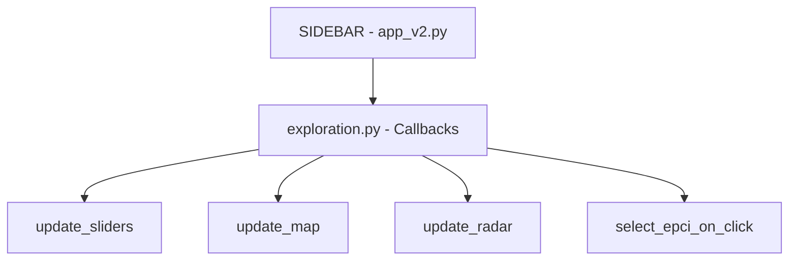

## 4. Architecture et Flux

### Fichier : `app_v2.py`

Ce fichier contient :
1. L'initialisation de l'app Dash
2. La construction du **layout global** (AppShell)
3. Les **callbacks de navigation** et de gestion du panneau d'aide

### Architecture du layout (AppShell Mantine)

```
MantineProvider (thème : blue, Inter font)
└── AppShell
    ├── AppShellHeader (h=130px)
    │   ├── Ligne 1 : Logo Senio + Badge Région + Tabs Navigation (Accueil / Exploration / Méthodologie)
    │   └── Ligne 2 : Titre "Diagnostic Territorial..." + Bouton "Afficher l'aide"
    │
    ├── AppShellNavbar (width=350px) — Sidebar gauche
    │   ├── ScrollArea
    │   │   ├── Sélection indicateur santé (Type: INCI/MORT/PREV + Pathologie: AVC/CardIsch/InsuCard)
    │   │   ├── Filtres Socio-Économie (MultiSelect + Sliders dynamiques)
    │   │   ├── Filtres Offre de Soins (MultiSelect + Sliders dynamiques)
    │   │   ├── Filtres Environnement (MultiSelect + Sliders dynamiques)
    │   │   └── Sélection EPCI à comparer (MultiSelect)
    │   └── Footer "HEC Capstone Project v3.0"
    │
    ├── AppShellMain
    │   └── ScrollArea → Container → #page-content (injection dynamique des pages)
    │
    └── AppShellAside (width=450px) — Panneau d'aide (togglable)
        ├── Titre "Aide & Mode d'emploi" + Bouton fermer
        └── ScrollArea → #aside-content (contenu dynamique)
```

### Callbacks de navigation

| Callback | Trigger | Action |
|---|---|---|
| `unified_navigation` | URL change OU Tab click | Synchronise l'URL, l'onglet actif, et la visibilité de la sidebar |
| `display_page` | URL change | Injecte le layout de la page correspondante dans `#page-content` |
| `toggle_guide_button` | URL change | Affiche/masque le bouton "Aide" (visible uniquement sur Exploration) |

---

## 7. Flux de données et callbacks

### Diagramme de flux global



### Tableau récapitulatif des IDs

| ID | Composant | Fichier | Rôle |
|---|---|---|---|
| `url` | `dcc.Location` | app_v2.py | Routage SPA |
| `nav-tabs` | `dmc.Tabs` | app_v2.py | Navigation header |
| `map-graph` | `dcc.Graph` | exploration.py | Carte choroplèthe |
| `radar-chart` | `dcc.Graph` | exploration.py | Radar comparatif |
