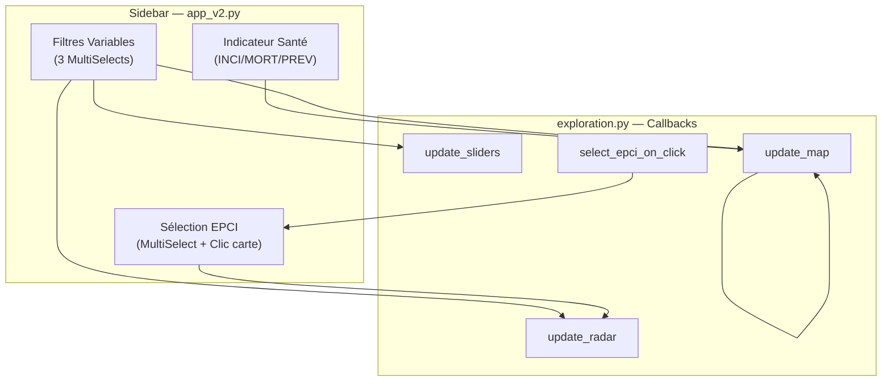

# 🏗️ Architecture & Flux de Données

## Vue d'ensemble de `app_v2.py`

Ce fichier est le **chef d'orchestre** de l'application (~590 lignes). Il réunit :

1. L'initialisation de l'instance Dash
2. Le layout global imbriqué (`AppShell` Mantine)
3. Tous les callbacks de navigation et de gestion du panneau d'aide

---

## Layout global — AppShell Mantine

```
MantineProvider
└── AppShell (padding="md", header_height=130)
    │
    ├── AppShellHeader
    │   ├── Ligne 1 — Logo + Badge Région + Navigation (Tabs pills)
    │   │            └── Bouton icône "Documentation Technique"
    │   └── Ligne 2 — Titre "Diagnostic Territorial..." + Bouton "Afficher l'aide"
    │
    ├── AppShellNavbar (width=350px)  ← Masquée hors page Exploration
    │   └── ScrollArea
    │       ├── Select — Type d'indicateur (Incidence / Mortalité / Prévalence)
    │       ├── Select — Pathologie (AVC / Cardiopathie Isch. / Insuffisance Card.)
    │       ├── Section Socio-Économie   → MultiSelect + RangeSliders dynamiques
    │       ├── Section Offre de Soins   → MultiSelect + RangeSliders dynamiques
    │       ├── Section Environnement    → MultiSelect + RangeSliders dynamiques
    │       ├── MultiSelect — Sélection EPCI pour Radar
    │       └── Footer "HEC Capstone v3.0"
    │
    ├── AppShellMain
    │   └── ScrollArea → Container (fluid) → #page-content
    │                    ↑ Injection dynamique selon l'URL active
    │
    └── AppShellAside (width=450px)  ← Togglable via bouton Aide
        ├── Header : "Aide & Mode d'emploi" + Bouton Fermer
        └── ScrollArea → #aside-content
```

---

## Callbacks de navigation

### `unified_navigation`

Callback principal qui synchronise l'état de toute la navigation.

```python
@callback(
    Output("url", "pathname"),
    Output("nav-tabs", "value"),
    Output("app-shell", "navbar"),
    Input("url", "pathname"),
    Input("nav-tabs", "value")
)
def unified_navigation(pathname, tab_value): ...
```

**Comportement** :
- Si l'URL change → met à jour l'onglet actif
- Si l'onglet change → met à jour l'URL
- La **sidebar** (navbar) est automatiquement masquée sur Accueil et Méthodologie :
```python
current_navbar["collapsed"] = {"desktop": not is_exploration, "mobile": True}
```

### Autres callbacks `app_v2.py`

| Callback | Déclencheur | Effet |
|:---|:---|:---|
| `display_page` | URL change | Injecte le layout de la page dans `#page-content` |
| `toggle_guide_button` | URL change | Affiche/masque le bouton "Afficher l'aide" (Exploration uniquement) |
| `toggle_aside_store` | Click bouton Aide | Toggle `dcc.Store` booléen (`aside-opened-store`) |
| `sync_aside_state` | Changement Store | Applique `collapsed` ou `visible` au panneau Aside |
| `close_aside` | Click fermer OU navigation | Force la fermeture du panneau |

---

## Flux de données global



---

## Identifiants de composants clés

| ID | Composant | Fichier | Rôle |
|:---|:---|:---|:---|
| `url` | `dcc.Location` | app_v2.py | Routage SPA (`/`, `/exploration`, `/leviers`, `/methodologie`) |
| `nav-tabs` | `dmc.Tabs` | app_v2.py | Navigation header |
| `app-shell` | `dmc.AppShell` | app_v2.py | Shell principal |
| `page-content` | `html.Div` | app_v2.py | Conteneur d'injection de page |
| `aside-opened-store` | `dcc.Store` | app_v2.py | État du panneau d'aide |
| `exploration-guide-btn` | `dmc.Button` | app_v2.py | Toggle panneau aide |
| `map-indic-select` | `dmc.Select` | app_v2.py | Type indicateur |
| `map-patho-select` | `dmc.Select` | app_v2.py | Pathologie |
| `sidebar-filter-social` | `dmc.MultiSelect` | app_v2.py | Filtres Socioéco |
| `sidebar-filter-offre` | `dmc.MultiSelect` | app_v2.py | Filtres Offre de soins |
| `sidebar-filter-env` | `dmc.MultiSelect` | app_v2.py | Filtres Environnement |
| `sidebar-epci-radar` | `dmc.MultiSelect` | app_v2.py | Sélection EPCI Radar |
| `map-graph` | `dcc.Graph` | exploration.py | Carte choroplèthe |
| `radar-chart` | `dcc.Graph` | exploration.py | Radar comparatif |
| `highlight-variable-select` | `dmc.Select` | exploration.py | Filtre d'exclusion par variable |
| `{'type':'exploration-slider','index':var}` | `dcc.RangeSlider` | exploration.py | Sliders dynamiques (pattern-matching) |
