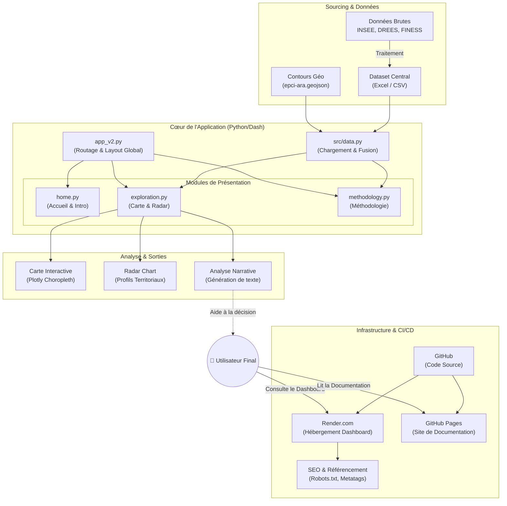

# 🫀 SeniAura — Documentation Technique

> **Version** : 3.0 — Mars/Avril 2026  
> **Framework** : Python · Dash · Dash Mantine Components (v7) · Plotly  
> **Couverture géographique** : Région Auvergne-Rhône-Alpes (ARA) — 132+ EPCI

---

## Présentation du projet

**CardiAura** (anciennement SeniAura) est un tableau de bord interactif médical permettant d'explorer, de filtrer et d'analyser les déterminants des **maladies cardio-neuro-vasculaires (CNR)** à l'échelle des Établissements Publics de Coopération Intercommunale (EPCI) de la région Auvergne-Rhône-Alpes.

Il a été développé dans le cadre d'un **projet Capstone HEC** en partenariat avec des acteurs de santé régionaux.

!!! tip "Objectif"
    Fournir aux professionnels de santé, acteurs territoriaux et décideurs publics une lecture fine et comparative des inégalités de santé cardiovasculaire à l'échelle intercommunale.

---

## Fonctionnalités principales

| Fonctionnalité | Description |
|:---|:---|
| **🗺️ Carte choroplèthe** | Visualisation colorée de l'Incidence, Mortalité ou Prévalence (AVC, Insuffisance Cardiaque, Cardiopathie Ischémique) par EPCI |
| **🎛️ Filtrage multi-variables** | Sliders dynamiques pour isoler des EPCI selon 30+ critères socio-économiques, d'offre de soins et d'environnement |
| **📡 Radar comparatif** | Comparaison multi-axes de territoires sélectionnés (jusqu'à 8 EPCI simultanément) vs. la moyenne régionale |
| **📝 Analyse narrative** | Interprétations textuelles automatiques et positionnement en quintiles régionaux |
| **👁️ Highlight d'exclusion** | Visualisation des EPCI exclus par une variable spécifique parmi les filtres actifs |
| **💡 Leviers d'action** | Page dédiée aux interventions et à la littérature scientifique |
| **📚 Méthodologie intégrée** | Tables descriptives des variables avec descriptions, unités et sources institutionnelles |
| **🧩 Demographics genrés** | 6 agrégats démographiques H/F ventilés par classe d'âge (0-24, 25-64, 65+) |

---

## Stack technique

```
Python 3.10+
├── dash >= 2.x               # Framework web réactif (SPA - Single Page Application)
├── dash-mantine-components   # Composants UI premium (v0.14, Mantine v7)
├── dash-iconify              # Icônes vectorielles (Solar icon set via Iconify)
├── plotly >= 5.x             # Moteur graphique (Choropleth, Scatterpolar, Scattergeo)
├── geopandas                 # Manipulation géospatiale (GeoDataFrame, CRS)
├── pandas / numpy            # Traitement de données tabulaires
├── openpyxl                  # Lecture des fichiers Excel .xlsx
└── gunicorn                  # Serveur WSGI de production
```

---

## Architecture détaillée



---

## Navigation dans la documentation

| Section | Contenu |
|:---|:---|
| [🗂️ Arborescence](structure.md) | Structure des fichiers du projet |
| [🗃️ Données](data.md) | Pipeline de chargement, métadonnées, agrégats démographiques |
| [🏗️ Architecture & Flux](backend.md) | Layout AppShell, callbacks globaux, navigation |
| [📄 Pages](pages.md) | Logique des 3 pages principales |
| [🎨 Assets Front-end](frontend.md) | CSS, animations, JavaScript |
| [🚀 Déploiement & FAQ](ops.md) | Mise en production et questions récurrentes |
